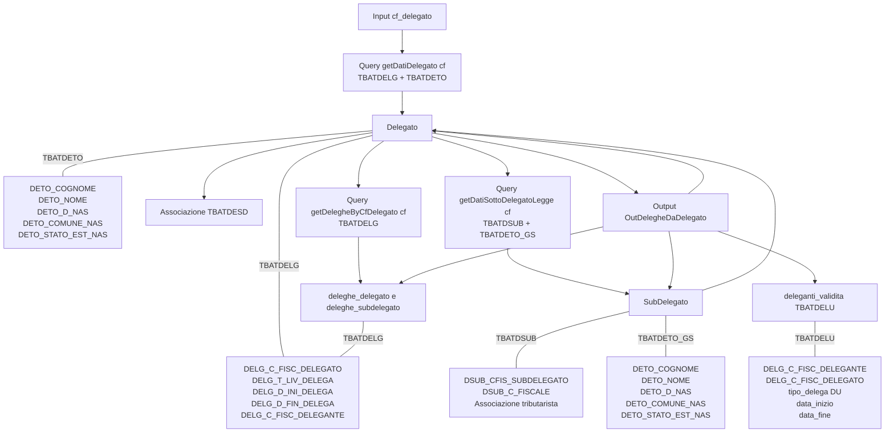

# Flusso di interrogazione delle deleghe

### 1. Query dirette (classe `Query`)

|Metodo|Descrizione|
|---|---|
|`Query.getDatiDelegato(input.cf_delegato)`|Recupera i dati anagrafici di un delegato: nome, cognome, data di nascita, livello di delega.|
|`Query.getDatiSottoDelegatoLegge(input.cf_delegato)`|Recupera i dati di un sottodelegato legato ad associazioni di categoria.|
|`Query.getDatiSottoDelegatoAssociazioni(input.cf_delegato)`|Recupera i dati di un sottodelegato secondo la normativa “Legge GS” (tributaristi).|
|`Query.getDelegheByCfDelegato(cod_fiscale_delegato)`|Restituisce tutte le deleghe legate a un delegato o ai suoi sottodelegati.|
|`Query.getDelu(input.cf_delegato)`|Recupera i dati dei deleganti unici (DU), soggetti senza deleghe classiche.|

---

## 2. Query indirette (classe `Utility`)

|Metodo|Descrizione|Quando viene usato|
|---|---|---|
|`Utility.getDatiAssociazioneCategoria(delega.codice_fiscale_delegato)`|Recupera dati dell’associazione di categoria collegata a un delegato (tipo AA)|Quando la delega è di tipo AA (associazione di categoria)|
|`Utility.getDatiAssociazioneTributarista(sub.codice_fiscale_delegato)`|Recupera dati associazione per sottodelegati tributaristi|Sottodelegati di tipo tributarista|
|`Utility.getDatiAssociazioneTributarista(delega.codice_fiscale_delegato)`|Recupera dati associazione per delegati tributaristi|Quando la delega è di tipo IT (tributarista)|
|`Utility.getDatiSoggetto(Reader_3["DELG_C_FISC_DELEGANTE"].ToString(), ref delega)`|Restituisce dati anagrafici del soggetto delegante e arricchisce la delega|Sempre per popolare dati anagrafici del delegante|

---

## 3. Tabelle principali

### 3.1 TBATDELG – Deleghe

Contiene tutte le informazioni sulle deleghe vere e proprie.

**Campi principali:**

|Campo DB2|Campo output|Note|
|---|---|---|
|DELG_C_FISC_DELEGATO|`Delega.codice_fiscale_delegato`|CF del delegato o sub-delegato|
|DELG_T_LIV_DELEGA|`Delega.tipo_delega`|Tipo delega: "AA" = Associazione, "IT" = Tributarista, ecc.|
|DELG_D_INI_DELEGA|`Delega.data_inizio_delega`|Data inizio validità delega|
|DELG_D_FIN_DELEGA|`Delega.data_fine_delega`|Data fine validità delega (null = attiva)|
|DELG_C_FISC_DELEGANTE|`Delega.codice_fiscale_delegante`|CF del delegante|

**Note aggiuntive:**

- Le informazioni anagrafiche del delegante non sono presenti in TBATDELG e vengono popolate tramite `Utility.getDatiSoggetto(DELG_C_FISC_DELEGANTE)`.
    

---

### 3.2 TBATDETO – Delegati

Contiene dati anagrafici di delegati e sottodelegati.

**Campi principali:**

|Campo DB2|Campo output|Note|
|---|---|---|
|DETO_COGNOME|`Delegato.cognome_delegato` / `SubDelegato.delegato.cognome_delegato`|Cognome delegato o delegato padre|
|DETO_NOME|`Delegato.nome_delegato` / `SubDelegato.delegato.nome_delegato`|Nome|
|DETO_D_NAS|`Delegato.data_nascita_delegato`|Data di nascita|
|DETO_COMUNE_NAS|`Delegato.comune_nascita`|Comune di nascita|
|DETO_STATO_EST_NAS|`Delegato.stato_estero_nascita`|Stato estero di nascita, se estero|

**Uso:**

- Popola `output.delegato` se è un delegato principale.
    
- Popola `sub.delegato` se è un sottodelegato (collegato al padre).
    

---

### 3.3 TBATDSUB – Sottodelegati tributaristi

Contiene informazioni sui sottodelegati secondo la normativa tributarista.

**Campi principali:**

- `SubDelegato.codice_fiscale_subd`
    
- `SubDelegato.codice_fiscale_delegato` (CF del delegato padre)
    
- Dati anagrafici del sub-delegato e del delegato padre (`sub.delegato`)
    
- Associazione tributarista tramite `Utility.getDatiAssociazioneTributarista`
    

---

### 3.4 TBATDESD – Sottodelegati associazioni di categoria

Contiene informazioni sui sottodelegati legati ad associazioni di categoria.

**Campi principali:**

- `SubDelegato.codice_fiscale_subd`
    
- `SubDelegato.codice_fiscale_delegato` (delegato padre)
    
- `SubDelegato.associazione` (codice, denominazione, ecc.)
    
- Dati anagrafici delegato padre da TBATDETO
    

---

### 3.5 TBATDELU – Deleganti unici (DU)

Contiene i deleganti senza deleghe classiche.

**Campi principali:**

- `DeleganteValidita.codice_fiscale_delegato`
    
- `DeleganteValidita.codice_fiscale_delegante`
    
- `tipo_delega = "DU"`
    
- Date di inizio e fine validità
    

---

## 4. Riepilogo: dove va cosa

|Tabella|Riempie|Nodi output|
|---|---|---|
|TBATDELG|CF delegato, CF delegante, tipo, date inizio/fine|deleghe_delegato / deleghe_subdelegato|
|TBATDETO|Cognome, nome, nascita, comune, stato estero|delegato / sottodelegato.delegato|
|TBATDSUB|CF sub-delegato, CF delegato padre, associazione|sottodelegato tributarista|
|TBATDESD|CF sub-delegato, CF delegato padre, associazione|sottodelegato associazione di categoria|
|TBATDELU|CF delegante, date|deleganti_validita|

---

## 5. Flusso logico   `<---` caricato su NC come 'DelegheDaDelegato_MermaidFlusso'

